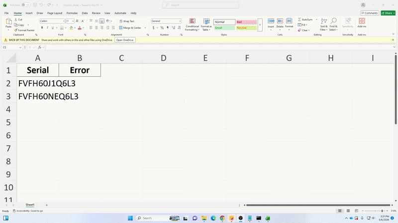

# macbook-checkin
> Python script that automates MacBook check-in workflows in a school district, including reporting, email notifications, and inventory updates.
> 
> ⚠️ Internal tool only: This is designed for use by THS/TMS technicians only.
> 

## Overview

This script automates bulk device check-in tasks. You paste serial numbers into an Excel sheet, and the script uses Playwright to handle browser workflows like checking in devices, updating student records, and sending email notifications. If a check-in fails, the script logs a description of the error in the second column of the spreadsheet.

### Efficiency

| Task | Estimated Time |
|---|---:|
| Manual setup (50 devices) | ~50 min |
| Automated with this script | ~6 min |

**Estimated Time saved:** ~44 minutes (~88% faster)

At district scale, this can save several technician-hours during large check-in events.

## Demo



## Requirements
- Windows 10/11
- Python 3.10+

## Installation & Setup
  1. Download this repository (ZIP) and extract it to your Desktop
  2. Paste the list of serial numbers into the appropriate column in `checkin_sheet.xlsx`, located in the project folder
  3. Save and close the spreadsheet

## First Use
  1. In the command prompt, navigate to where you have this repo saved

  ```
  cd Desktop\macbook-checkin
  ```

  2. Run the following commands sequentially. This will ensure you have all necessary packages installed

  ```
  py -m venv venv
  venv\Scripts\activate.bat
  pip install -r requirements.txt
  playwright install
  ```

  3. Run the main script

  ```
  py main.py
  ```

  4. Upon first running the program, you will be prompted to enter your credentials for each step. After that, the program will save them to Windows Credential Locker using keyring. If you entered these incorrectly, you can simply edit them by running the program with the `--reset-credentials` argument.

```
py main.py --reset-credentials
```

## Quick Start (Subsequent Uses)

  After your first successful use of the program, you can run it again with the following:

  ```
  cd Desktop\macbook-checkin
  venv\Scripts\activate.bat
  py main.py
  ```

  This will change your directory to the project folder, start the virtual environment, and run the script.

## CLI Arguments
To reset sensitive information (usernames/passwords), use the `--reset-credentials` arg:

```
py main.py --reset-credentials
```

To reset your school choice, use `--reset-school-info`.

```
py main.py --reset-school-info
```

Alternatively, you can edit this in the `schoolinfo.json` file.

## Troubleshooting
### pip not recognized as a command
If pip is not being recognized as a command, you may need to add a couple paths to your system's PATH environment variable  
  * Search for "environment variables" in the Windows search bar and open the first result
  * Click Environment Variables, and select the Path variable under User Variables
  * Click New and add the path to your Python installation (ex: C:\Users\yourname\AppData\Local\Programs\Python\Python313)
  * Also add the path to the Scripts folder within your Python installation (ex: C:\Users\yourname\AppData\Local\Programs\Python\Python313\Scripts)
  * You can then restart command prompt and type the following to ensure pip is working

    ```
    pip --version
    ```

### Execution of scripts is disabled
If your system is blocking the execution of the venv exe, you'll need to do the following:
  * Open Windows Security, and go to Virus & threat protection
  * Click "Manage settings" under Virus & threat protection settings
  * Under Exclusions, click "Add or remove exclusions"
  * Add the path to your Python folder (ex: C:\Users\yourname\AppData\Local\Programs\Python)
  * Add the path to the project folder (ex: C:\Users\yourname\Desktop\macbook-checkin)
